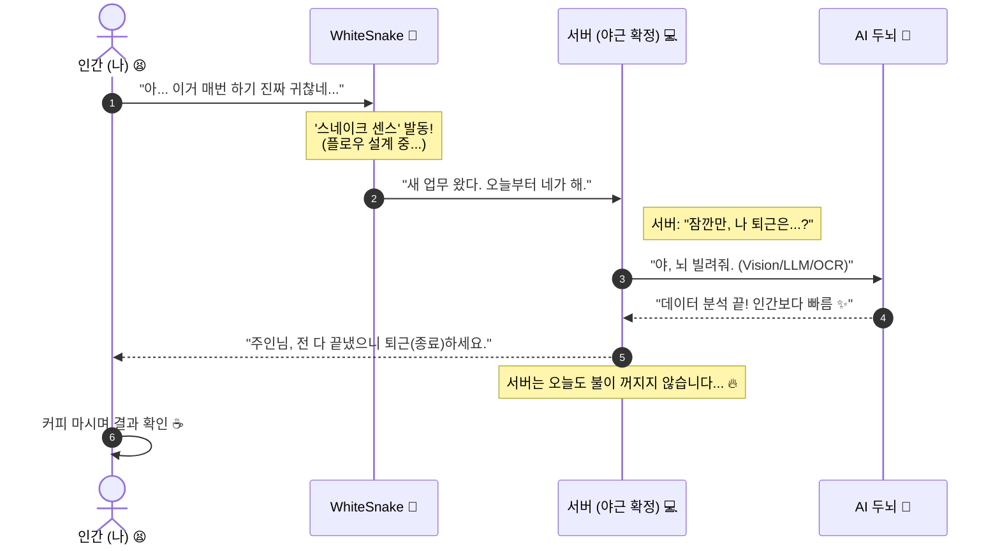
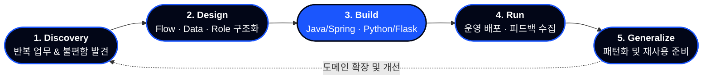

  

   

  

  

  

  
  
  
  

<blockquote align="center">
  <b>"위 기술들은 실제 서버 야근에 투입되어 인간의 칼퇴를 돕고 있습니다."</b>
</blockquote>

---

### Me as a System

---

<h3>"My Loop (내가 일하는 루프)"</h3>

---

### 🐍 System Status: Working Hard (Server Night-Shift)

> **[Core]** `Java 21` · `Spring Boot` · `MariaDB` 
> - *성격: 묵묵히 시키는 거 다 하는 타입 (야근 주동자)*

> **[Intelligence]** `YOLO v11` · `OpenAI` · `OpenCV`
> - *성격: 눈치가 빠름. 문자와 사물을 0.1초 만에 훑음*

> **[Automation]** `UiPath` · `RPA` · `Python`
> - *성격: 단순 반복은 질색. 대신 손가락 까딱해줌*

> **[Base]** `Linux` · `Docker` · `GitHub`
> - *성격: 서버가 도망가지 못하게 지키는 중*

---

## Contact

- GitHub: [WhiteSnake-MrBBoo](https://github.com/WhiteSnake-MrBBoo)  
- Email: mrbulsapabb@gmail.com  

“반복을 줄이고, 더 나은 흐름을 만들고 싶은 사람들과  
코드와 아키텍처로 대화하는 것을 좋아합니다.”

---

## 더 보기 & 연락

- 상세 포트폴리오 및 케이스 스터디:  
  → [information_portfolio](https://github.com/WhiteSnake-MrBBoo/information_portfolio)
- 대표 AI 백오피스 프로젝트:  
  → [bboo_technology](https://github.com/WhiteSnake-MrBBoo/bboo_technology)
- Email: **mrbulsapabb@gmail.com**

> “새로운 업무 흐름을 자동화하거나, Vision/OCR/LLM을 서비스에 녹이고 싶다면  
>  언제든지 코드와 아키텍처로 이야기할 준비가 되어 있습니다.”
