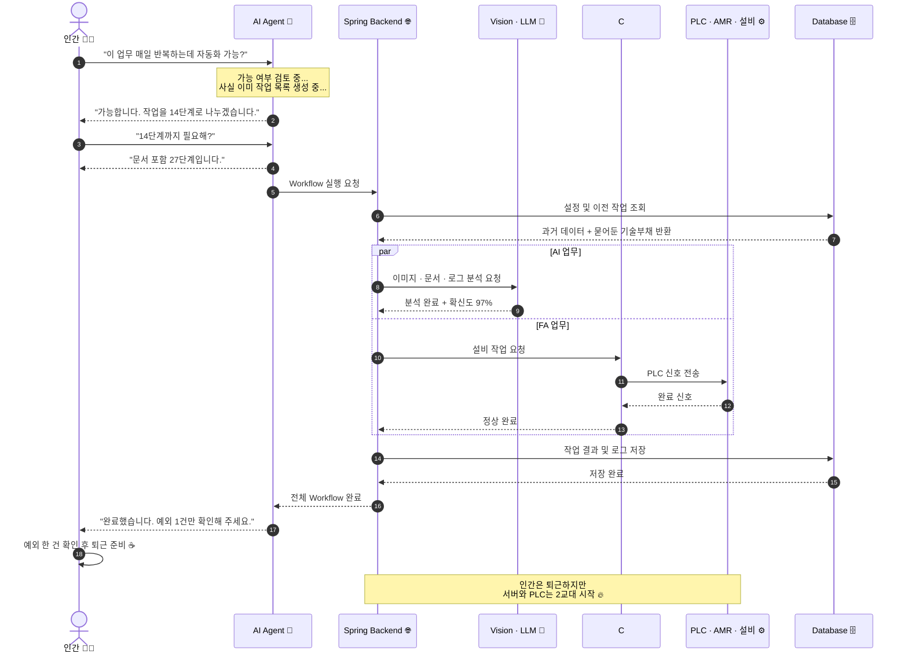
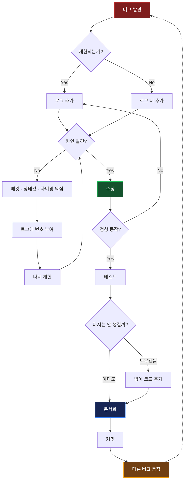
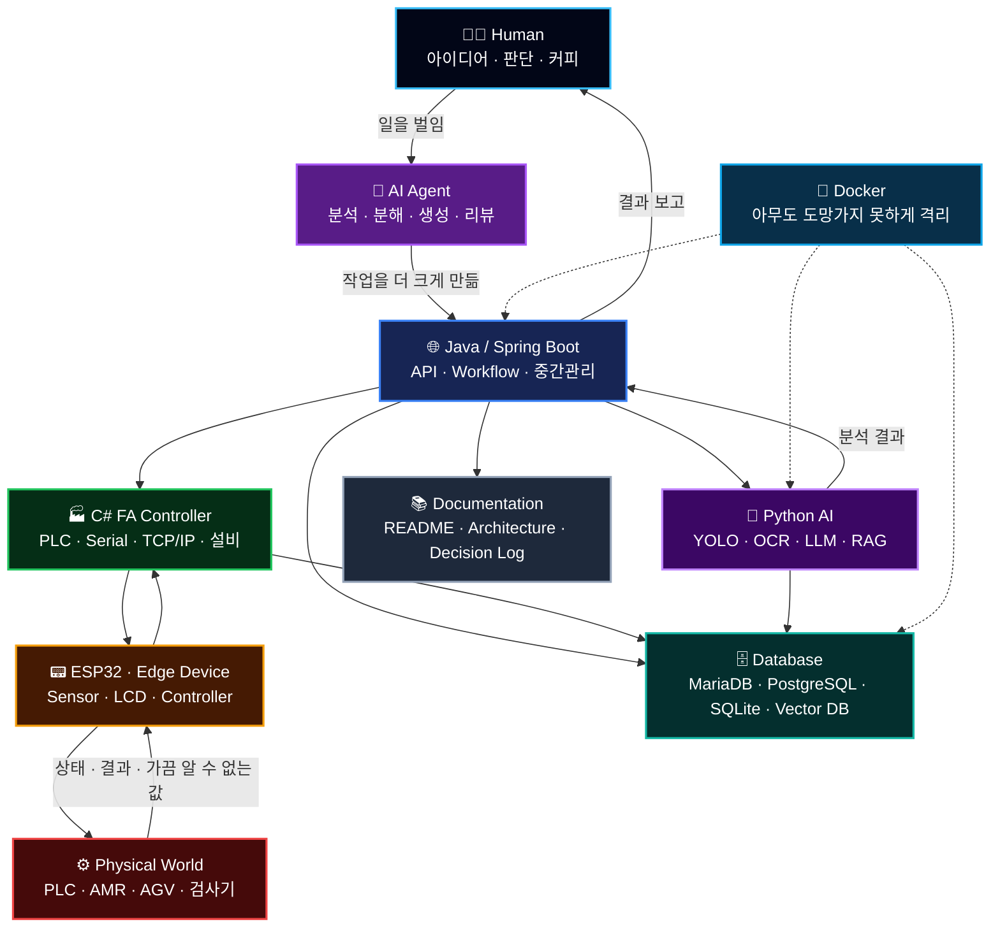
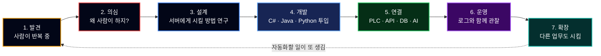

<div align="center">


<a href="https://github.com/WhiteSnake-MrBBoo">
  
</a>

<br />

# 🐍 WhiteSnake · MrBBoo

### FA Automation · Backend · AI Vision · AI Agent

**PLC 신호도 받고, REST 요청도 받고, 가끔 버그의 사과도 받습니다.**

현장의 설비와 장비를 제어하는 `C#`부터
서비스를 운영하는 `Spring Boot`,
눈치 빠른 `Vision AI`,
말은 잘 듣지만 가끔 너무 많이 고치는 `AI Agent`까지 연결합니다.

<br />


</div>

---

## 👨‍💻 개발자 소개

```csharp
public class MrBBoo : AutomationEngineer
{
    public bool SeesRepetitiveWork { get; set; }
    public int CoffeeLevel { get; set; }
    public List<Bug> EscapedBugs { get; set; }

    public void Work()
    {
        while (SeesRepetitiveWork)
        {
            Analyze();
            Automate();
            AddLogging();

            Human.GoHome();
            Server.WorkOvertime();
        }
    }
}
```

반복 작업을 보면 그냥 지나치지 못합니다.

처음에는 이렇게 생각합니다.

> “이거 한두 번이면 그냥 하지 뭐.”

세 번째 반복부터는 생각이 바뀝니다.

> “잠깐만. 이건 내가 할 일이 아니라 서버가 할 일인데?”

다섯 번째 반복부터는 이미 프로젝트 폴더가 만들어져 있습니다.

```text
automation-project/
├── backend/
├── device-controller/
├── ai-service/
├── docker/
├── docs/
└── README_이번에는_진짜_최종.md
```

---

## 🧪 개발자 사용 설명서

| 항목     | 상태                            |
| ------ | ----------------------------- |
| 주요 동력원 | 커피, 로그, 이상하게 안 되는 코드          |
| 선호 업무  | 반복 업무 제거, 시스템 연결, 장애 원인 추적    |
| 특기     | PLC와 서버 사이에서 통역하기             |
| 취미     | 로그에 번호 붙이기                    |
| 습관     | 정상 동작해도 로그를 한 줄 더 넣음          |
| 약점     | “간단한 기능 하나만”이라는 문장            |
| 천적     | 재현되지 않는 버그                    |
| 최종 목표  | 사람은 판단만 하고 시스템이 나머지를 처리하게 만들기 |

> **주의사항**
> “이거 자동화 가능할까요?”라고 물으면
> 높은 확률로 아키텍처 다이어그램부터 그리기 시작합니다.

---

## 🏭 제가 만드는 것들

<table>
<tr>
<td width="50%" valign="top">

### ⚙️ FA & Industrial Automation

* C# WinForms 설비 제어
* PLC 통신 및 Handshake
* AMR · AGV · RCS 연동
* Serial · TCP/IP · Socket 통신
* 검사기 및 산업용 장비 제어
* 상태 머신 기반 공정 Flow
* 장애 감지 및 자동 재연결
* ESP32 기반 Edge Device

<br />

**주요 업무**

```text
PLC: 신호 보냄
C#: 신호 받음
장비: 움직임
나: 로그 봄
현장: 왜 안 돼요?
나: 로그 한 줄만 더 볼게요.
```

</td>
<td width="50%" valign="top">

### 🌐 Backend & Data

* Java 21 · Spring Boot
* REST API 설계
* 서비스 · 도메인 계층 분리
* MariaDB · MySQL · PostgreSQL
* SQLite 로컬 데이터베이스
* 장비 데이터 수집 및 이력 관리
* Docker 기반 서비스 구성
* On-Premise Architecture

<br />

**Backend의 역할**

```text
요청을 받고
검증을 하고
DB에 저장하고
AI를 부르고
C#에 일을 시키고
문제가 생기면 로그를 남깁니다.

즉, 중간 관리자입니다.
```

</td>
</tr>

<tr>
<td width="50%" valign="top">

### 👁️ AI Vision & Intelligence

* Python · Flask
* YOLO 객체 탐지
* OpenCV 영상 처리
* OCR · Tesseract
* OpenAI API
* LLM · RAG
* Vector Database
* 검사 및 문서 자동화

<br />

**AI Vision 사용 목적**

```text
사람: "저기 뭐가 이상한 것 같은데?"
AI: "3번 위치에 불량 가능성 92.4%"
사람: "어떻게 알았어?"
AI: "픽셀을 많이 봤습니다."
```

</td>
<td width="50%" valign="top">

### 🤖 AI Agent & Workflow

* AI Agent 기반 업무 분해
* Codex 기반 개발 Workflow
* Tool Calling
* API Orchestration
* 코드 생성 및 리팩터링
* 코드 리뷰와 테스트
* 기술 문서 자동화
* Human-in-the-Loop

<br />

**AI Agent 운영 원칙**

```text
Agent에게 모든 권한을 주지는 않습니다.

처음에는 문서를 맡기고,
다음에는 코드를 맡기고,
마지막에는 Git diff를 확인합니다.

신뢰는 하지만 git status는 봅니다.
```

</td>
</tr>
</table>

---

## 🤖 우리 회사에는 사람이 한 명입니다


```mermaid
sequenceDiagram
    autonumber

    actor H as 인간 👨‍💻
    participant A as AI Agent 🤖
    participant B as Spring Backend 🌐
    participant V as Vision · LLM 🧠
    participant C as C# Controller 🏭
    participant P as PLC · AMR · 설비 ⚙️
    participant D as Database 🗄️

    H->>A: "이 업무 매일 반복하는데 자동화 가능?"
    
    Note over A: 가능 여부 검토 중...<br/>사실 이미 작업 목록 생성 중...

    A-->>H: "가능합니다. 작업을 14단계로 나누겠습니다."
    H->>A: "14단계까지 필요해?"
    A-->>H: "문서 포함 27단계입니다."

    A->>B: Workflow 실행 요청
    B->>D: 설정 및 이전 작업 조회
    D-->>B: 과거 데이터 + 묻어둔 기술부채 반환

    par AI 업무
        B->>V: 이미지 · 문서 · 로그 분석 요청
        V-->>B: 분석 완료 + 확신도 97%
    and FA 업무
        B->>C: 설비 작업 요청
        C->>P: PLC 신호 전송
        P-->>C: 완료 신호
        C-->>B: 정상 완료
    end

    B->>D: 작업 결과 및 로그 저장
    D-->>B: 저장 완료

    B-->>A: 전체 Workflow 완료
    A-->>H: "완료했습니다. 예외 1건만 확인해 주세요."

    H->>H: 예외 한 건 확인 후 퇴근 준비 ☕
    
    Note over B,P: 인간은 퇴근하지만<br/>서버와 PLC는 2교대 시작 🔥
```

---

## 🐞 버그 대응 프로세스


```mermaid
flowchart TD
    A["버그 발견"] --> B{"재현되는가?"}

    B -->|"Yes"| C["로그 추가"]
    B -->|"No"| D["로그 더 추가"]

    C --> E{"원인 발견?"}
    D --> E

    E -->|"Yes"| F["수정"]
    E -->|"No"| G["패킷 · 상태값 · 타이밍 의심"]

    G --> H["로그에 번호 부여"]
    H --> I["다시 재현"]
    I --> E

    F --> J{"정상 동작?"}
    J -->|"Yes"| K["테스트"]
    J -->|"No"| C

    K --> L{"다시는 안 생길까?"}
    L -->|"아마도"| M["문서화"]
    L -->|"모르겠음"| N["방어 코드 추가"]

    N --> M
    M --> O["커밋"]
    O --> P["다른 버그 등장"]

    P -.-> A

    style A fill:#7F1D1D,stroke:#EF4444,color:#FFFFFF
    style F fill:#14532D,stroke:#22C55E,color:#FFFFFF
    style M fill:#172554,stroke:#3B82F6,color:#FFFFFF
    style P fill:#713F12,stroke:#F59E0B,color:#FFFFFF
```

> 버그는 제거되는 것이 아닙니다.
> **새로운 버그가 들어올 자리를 비워주는 것입니다.**

---

## 🧠 Me as a System


```mermaid
flowchart TB
    H["👨‍💻 Human<br/>아이디어 · 판단 · 커피"]

    A["🤖 AI Agent<br/>분석 · 분해 · 생성 · 리뷰"]

    J["🌐 Java / Spring Boot<br/>API · Workflow · 중간관리"]

    PY["🧠 Python AI<br/>YOLO · OCR · LLM · RAG"]

    CS["🏭 C# FA Controller<br/>PLC · Serial · TCP/IP · 설비"]

    EDGE["📟 ESP32 · Edge Device<br/>Sensor · LCD · Controller"]

    DEV["⚙️ Physical World<br/>PLC · AMR · AGV · 검사기"]

    DB["🗄️ Database<br/>MariaDB · PostgreSQL · SQLite · Vector DB"]

    DOC["📚 Documentation<br/>README · Architecture · Decision Log"]

    DOCKER["🐳 Docker<br/>아무도 도망가지 못하게 격리"]

    H -->|"일을 벌임"| A
    A -->|"작업을 더 크게 만듦"| J

    J --> PY
    J --> CS
    J --> DB
    J --> DOC

    PY -->|"분석 결과"| J
    CS --> EDGE
    EDGE --> DEV
    DEV -->|"상태 · 결과 · 가끔 알 수 없는 값"| EDGE
    EDGE --> CS

    CS --> DB
    PY --> DB

    DOCKER -.-> J
    DOCKER -.-> PY
    DOCKER -.-> DB

    J -->|"결과 보고"| H

    style H fill:#020617,stroke:#38BDF8,stroke-width:2px,color:#FFFFFF
    style A fill:#581C87,stroke:#A855F7,stroke-width:2px,color:#FFFFFF
    style J fill:#172554,stroke:#3B82F6,stroke-width:2px,color:#FFFFFF
    style PY fill:#3B0764,stroke:#C084FC,stroke-width:2px,color:#FFFFFF
    style CS fill:#052E16,stroke:#22C55E,stroke-width:2px,color:#FFFFFF
    style EDGE fill:#451A03,stroke:#F59E0B,stroke-width:2px,color:#FFFFFF
    style DEV fill:#450A0A,stroke:#EF4444,stroke-width:2px,color:#FFFFFF
    style DB fill:#042F2E,stroke:#14B8A6,stroke-width:2px,color:#FFFFFF
    style DOC fill:#1E293B,stroke:#94A3B8,stroke-width:2px,color:#FFFFFF
    style DOCKER fill:#082F49,stroke:#0EA5E9,stroke-width:2px,color:#FFFFFF
```

---

## 🔄 개발 루프


```mermaid
flowchart LR
    A["1. 발견<br/>사람이 반복 중"]
    B["2. 의심<br/>왜 사람이 하지?"]
    C["3. 설계<br/>서버에게 시킬 방법 연구"]
    D["4. 개발<br/>C# · Java · Python 투입"]
    E["5. 연결<br/>PLC · API · DB · AI"]
    F["6. 운영<br/>로그와 함께 관찰"]
    G["7. 확장<br/>다른 업무도 시킴"]

    A --> B --> C --> D --> E --> F --> G
    G -. "자동화할 일이 또 생김" .-> A

    style A fill:#020617,stroke:#F59E0B,stroke-width:2px,color:#FFFFFF
    style B fill:#020617,stroke:#EF4444,stroke-width:2px,color:#FFFFFF
    style C fill:#020617,stroke:#3B82F6,stroke-width:2px,color:#FFFFFF
    style D fill:#172554,stroke:#60A5FA,stroke-width:2px,color:#FFFFFF
    style E fill:#052E16,stroke:#22C55E,stroke-width:2px,color:#FFFFFF
    style F fill:#3B0764,stroke:#A855F7,stroke-width:2px,color:#FFFFFF
    style G fill:#042F2E,stroke:#14B8A6,stroke-width:2px,color:#FFFFFF
```

---

## 🧰 Tech Stack

<div align="center">

### Main Languages


<br />

> `C#`은 장비와 대화하고,
> `Java`는 시스템을 정리하고,
> `Python`은 AI를 데려옵니다.

<br />

### AI · Vision · Edge


<br />


<br />

### Database · Infrastructure


<br />

> 데이터베이스는 기억하고,
> Docker는 격리하고,
> Git은 제가 무슨 짓을 했는지 기록합니다.

<br />


</div>

---

## 📟 System Status

```yaml
developer:
  name: WhiteSnake-MrBBoo
  class: AutomationTroublemaker

  skills:
    fa:
      - C#
      - WinForms
      - PLC
      - AMR / AGV
      - Serial
      - TCP/IP

    backend:
      - Java
      - Spring Boot
      - REST API
      - Database
      - Docker

    ai:
      - Python
      - YOLO
      - OpenCV
      - OCR
      - LLM
      - RAG
      - AI Agent

  runtime:
    coffee: required
    logging: always
    documentation: surprisingly_yes
    automation_instinct: over_enabled

  status:
    human: "퇴근 각도 계산 중"
    server: "정상 야근 중"
    plc: "신호 대기 중"
    ai_agent: "요청하지 않은 개선점까지 찾는 중"
    bug: "내 PC에서는 재현 안 됨"
```

---

## 🚧 Current Projects

### 🏗️ Smart Control Center

`C# + Spring Boot + Python + Database + Docker`를 역할별로 분리해
설비 제어, 데이터 수집, AI 분석, 운영 모니터링을 하나로 연결하는
**On-Premise Smart Control Platform**을 개발하고 있습니다.

```text
C#          : 장비를 움직임
Spring Boot : 전체 Flow를 관리함
Python      : AI 분석을 담당함
Database    : 모든 것을 기억함
Docker      : 모두를 각자의 방에 넣음
나          : 왜 안 되는지 로그를 봄
```

### 🤖 AI Agent Development

AI Agent를 검색창이 아니라
실제 개발 Workflow에 참여하는 동료로 활용하고 있습니다.

* 프로젝트 문맥 분석
* 요구사항 및 작업 분해
* 코드 생성과 리팩터링
* 코드 리뷰 및 테스트 지원
* 문서와 Decision Log 작성
* 반복적인 유지보수 자동화

> AI Agent를 신뢰합니다.
> 다만 Merge 버튼은 제가 누릅니다.

### 🧠 Physical AI & Edge

ESP32, 센서, LCD, 설비 제어 장치를
Vision AI와 로컬 AI 서비스에 연결하는 구조를 연구하고 있습니다.

목표는 단순합니다.

```text
현실 세계에서 이벤트 발생
        ↓
센서와 장비가 감지
        ↓
AI가 판단
        ↓
시스템이 실행
        ↓
사람은 결과만 확인
```

물론 실제 개발 과정은 단순하지 않습니다.

```text
현실 세계에서 이벤트 발생
        ↓
통신 끊김
        ↓
재연결
        ↓
상태값 이상
        ↓
로그 추가
        ↓
다시 실행
        ↓
정상 동작
        ↓
왜 정상인지 다시 확인
```

---

## 📚 Featured Repositories

### Portfolio & Case Studies

<a href="https://github.com/WhiteSnake-MrBBoo/information_portfolio">
  
</a>

### AI Backoffice & Automation

<a href="https://github.com/WhiteSnake-MrBBoo/bboo_technology">
  
</a>

---

## 🤝 이런 이야기를 좋아합니다

* PLC와 Backend를 어떻게 연결할까?
* AMR · AGV의 상태를 어떻게 안정적으로 관리할까?
* Vision · OCR을 검사 공정에 어떻게 적용할까?
* LLM과 RAG를 On-Premise에서 어떻게 운영할까?
* AI Agent에게 어디까지 맡겨야 안전할까?
* 반복 업무를 어떻게 시스템으로 바꿀까?
* 왜 이 버그는 금요일 오후에만 나타날까?

마지막 질문에 대한 답은 아직 연구 중입니다.

---

## 📬 Contact

<div align="center">

### 자동화할 일이 있다면 이야기해 주세요.

처음에는 작은 프로그램으로 시작할 수 있습니다.

그리고 정신을 차려보면
Backend, Database, Docker, AI Agent가 포함된
통합 플랫폼이 되어 있을 수도 있습니다.

<br />

<a href="https://github.com/WhiteSnake-MrBBoo">
  
</a>

<a href="mailto:mrbulsapabb@gmail.com">
  
</a>

<br />
<br />

> **장비가 말을 안 들으면 프로토콜을 확인하고,**
> **서버가 말을 안 들으면 로그를 확인하고,**
> **사람이 같은 말을 반복하면 자동화를 시작합니다.**

<br />

### Human Status: 퇴근 준비 중

### Server Status: 야근 준비 완료

### AI Agent Status: 시키지도 않은 리팩터링 제안 중

<br />


</div>
